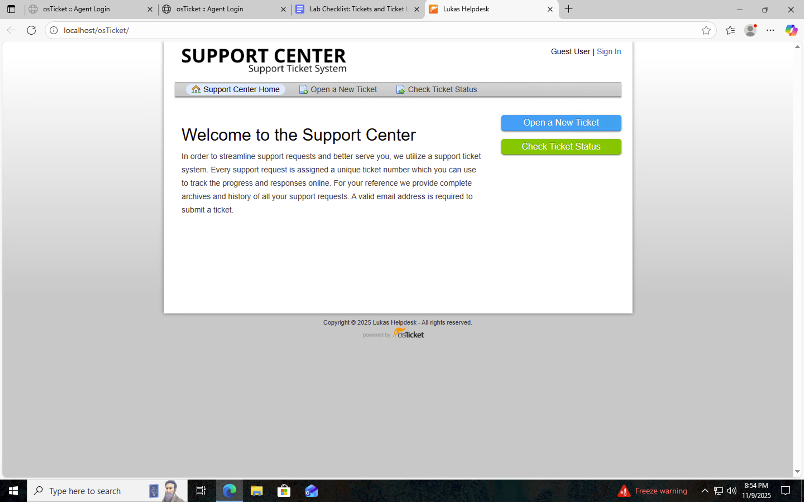
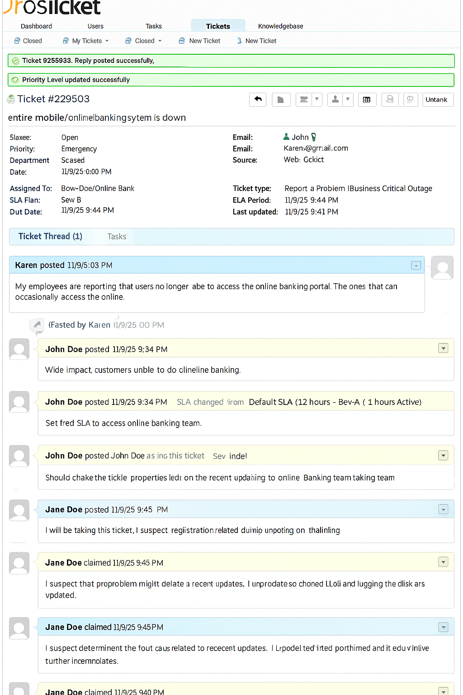
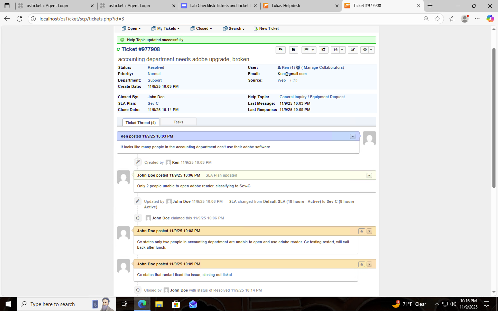
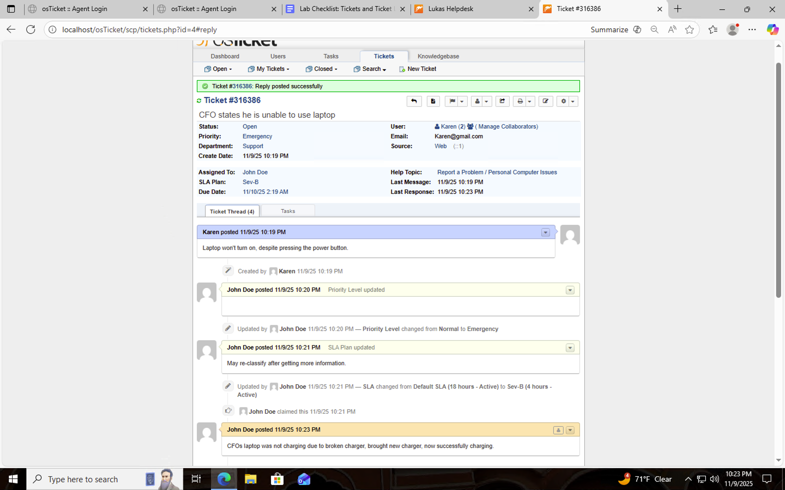

# osTicket - Ticket Lifecycle Management

This tutorial outlines the ticket creation, assignment, escalation, and resolution process within osTicket — simulating real-world IT service desk operations. The objective was to manage incidents from submission to resolution, applying SLA priorities and department routing.

---

### 🖥️ Environments and Technologies Used
- **Microsoft Azure** (Virtual Machines / Compute)
- **Remote Desktop**
- **Internet Information Services (IIS)**
- **osTicket v1.15.8**

---

### 💻 Operating Systems Used
- **Windows 10 (21H2)**

---

## 🎯 Ticket Lifecycle Objectives
1. Create and manage tickets as end users
2. Observe and edit ticket properties as help desk agents
3. Assign departments, priorities, and SLAs
4. Escalate and resolve tickets according to policies
5. Demonstrate understanding of help desk communication workflow

---

## ⚙️ Configuration & Lifecycle Steps

### Step 1: Admin and User Access
- **Admin Login:** [http://localhost/osTicket/scp/login.php](http://localhost/osTicket/scp/login.php)
- **End User Portal:** [http://localhost/osTicket](http://localhost/osTicket)

  
  

---

### Step 2: Create and Manage Tickets

#### 🧾 Ticket 1 — “Entire mobile/online banking system is down”
**Created By:** End User (Karen)  
**Agent:** John  

**Actions Taken:**
- Viewed ticket properties: Priority, Department, SLA, Assigned To  
- Set SLA: **Sev-A (1 hour, 24/7)**  
- Assigned Department: **Online Banking**  
- Verified visibility and access limitations when re-logging as John  
- Resolved ticket under **Jane (SysAdmins)** account

  

---

#### 🧾 Ticket 2 — “Accounting department needs Adobe upgrade, broken”
**Created By:** End User (Ken)  
**Agent:** John  

**Actions Taken:**
- Observed ticket properties  
- Set SLA: **Sev-C (8 hours, Business Hours)**  
- Assigned Department: **Support**  
- Worked ticket to completion as John  

  

---

#### 🧾 Ticket 3 — “CFO’s laptop will no longer turn on”
**Created By:** End User (Karen)  
**Agent:** John  

**Actions Taken:**
- Observed and updated ticket properties  
- Set SLA: **Sev-B (4 hours, 24/7)**  
- Assigned Department: **Support**  
- Completed troubleshooting and closed ticket as John  

  

---

## 🧾 Summary

This lab simulated a full IT support workflow — from ticket creation and SLA assignment to escalation and resolution.  
By repeating the process, help desk technicians build the intuition to manage tickets efficiently and maintain clear communication with users.

---

### 🧩 Skills Demonstrated
- Ticket Lifecycle Management  
- SLA Prioritization & Escalation  
- ITIL-Inspired Incident Management  
- RBAC (Role-Based Access Control)  
- Service Desk Communication  
- Problem Diagnosis and Resolution Workflow  
